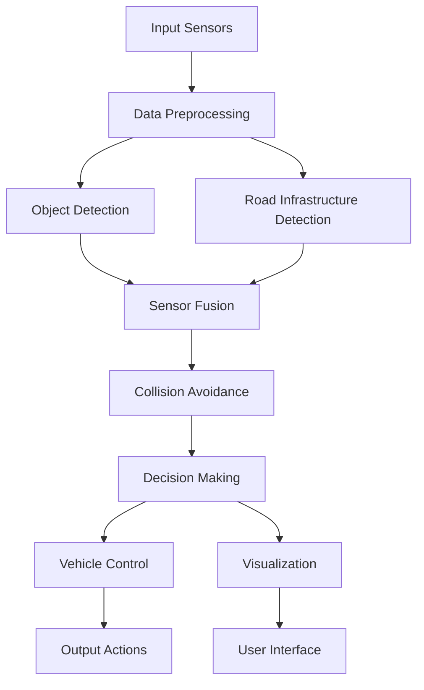

# ADAS System Architecture

## System Flowchart

## Component Descriptions

### 1. Input Sensors
- Camera (30 FPS)
- Radar
- LIDAR (simulated)

### 2. Data Preprocessing
- Camera:
  - Image normalization
  - Format conversion (BGR to RGB)
  - Resolution adjustment
- Radar:
  - Signal processing
  - Noise reduction
  - Data validation
- LIDAR:
  - Point cloud processing
  - Distance calculation
  - Object clustering

### 3. Object Detection
- Camera-based:
  - YOLOv8 model
  - Multiple object classes
  - Confidence scoring
- Radar-based:
  - Object tracking
  - Velocity estimation
  - Distance measurement
- LIDAR-based:
  - Point cloud segmentation
  - Object classification
  - 3D position estimation

### 4. Road Infrastructure Detection
- Lane detection
- Road boundary identification
- Traffic sign recognition
- Road surface condition analysis

### 5. Sensor Fusion
- Data correlation
- Coordinate transformation
- Confidence weighting
- Object tracking
- Multi-sensor validation

### 6. Collision Avoidance
- Risk assessment
- Time to collision calculation
- Path prediction
- Obstacle avoidance planning

### 7. Decision Making
- Risk level evaluation
- Action prioritization
- Emergency response
- Adaptive control

### 8. Vehicle Control
- Automated braking
- Steering assistance
- Lane keeping
- Adaptive cruise control

### 9. Visualization
- Real-time display
- Warning indicators
- Status information
- Debug visualization

### 10. User Interface
- Warning system
- Status display
- Control interface
- Feedback system

## Data Flow
1. Raw sensor data is collected
2. Data is preprocessed and validated
3. Objects are detected and classified
4. Road infrastructure is analyzed
5. Sensor data is fused
6. Collision risks are assessed
7. Decisions are made
8. Vehicle controls are activated
9. Results are visualized
10. User is notified

## Performance Metrics
- Object detection accuracy
- Sensor fusion reliability
- Collision prediction accuracy
- System response time
- Resource utilization
- False positive/negative rates 